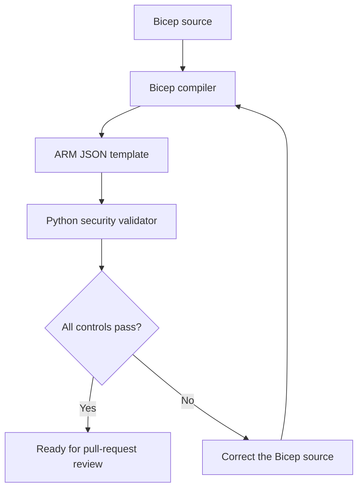

# Daily Ticket 03: Harden Azure Storage with Bicep

## Objective

Create and locally validate a security-hardened Azure Storage account definition
using Bicep without deploying cloud resources.

## Workplace Scenario

A platform engineering team needs an Azure Storage account for audit evidence.
Before the infrastructure code can be approved, it must demonstrate secure
transport, identity-based authentication, restricted network access, and
automated configuration validation.

The team requires a reviewable infrastructure-as-code artifact and evidence
showing that insecure settings are detected before deployment.

## Acceptance Criteria

- Use the `Microsoft.Storage/storageAccounts@2025-08-01` resource definition.
- Require TLS 1.2 or newer.
- Reject unencrypted HTTP traffic.
- Prevent anonymous blob access.
- Disable shared-key authorization.
- Prefer Microsoft Entra ID authentication.
- Deny network traffic unless explicitly authorized.
- Disable automatic firewall bypass for trusted Azure services.
- Use locally redundant storage for this non-production design.
- Compile the Bicep source successfully.
- Validate the compiled template with an automated Python test.
- Create no Azure resources.

## Architecture and Validation Flow



The Bicep compiler validates the template's structure and generates an Azure
Resource Manager JSON template. The Python validator then checks the generated
configuration against the ticket's security requirements.

Using both checks is important because compilation can succeed even when a
string value does not match the organization's required security baseline.

## Repository Structure

```text
tickets/azure/ticket-03-harden-azure-storage-bicep/
├── main.bicep
├── validate_template.py
├── README.md
└── evidence/
    ├── bicep-build.txt
    ├── compiled-template.json
    ├── security-validation-before-fix.txt
    └── security-validation.txt
```

## Prerequisites

- Windows with Git Bash
- Git
- Python 3.10 or later
- Azure CLI
- Bicep CLI installed through Azure CLI
- Visual Studio Code with the Bicep extension recommended

Verify the tools:

```bash
az --version
az bicep version
python --version
git --version
```

An Azure login and Azure subscription are not required because this ticket does
not deploy resources.

## Implementation

The Bicep configuration defines one `StorageV2` account using the
`Standard_LRS` redundancy option.

The principal security controls are:

| Requirement | Bicep setting |
|---|---|
| Require modern transport encryption | `minimumTlsVersion: 'TLS1_2'` |
| Reject unencrypted HTTP | `supportsHttpsTrafficOnly: true` |
| Prevent anonymous blob access | `allowBlobPublicAccess: false` |
| Disable storage access keys | `allowSharedKeyAccess: false` |
| Prefer Microsoft Entra ID | `defaultToOAuthAuthentication: true` |
| Retain endpoint for approved rules | `publicNetworkAccess: 'Enabled'` |
| Disable trusted-service bypass | `bypass: 'None'` |
| Deny unmatched network traffic | `defaultAction: 'Deny'` |

`publicNetworkAccess` remains enabled so that explicitly approved IP,
virtual-network, resource-instance, or private-endpoint designs can be added
later. The storage firewall still denies unmatched traffic because
`defaultAction` is `Deny`.

## Build Procedure

Set the ticket path:

```bash
TICKET_DIR="tickets/azure/ticket-03-harden-azure-storage-bicep"
```

Compile the Bicep source:

```bash
az bicep build \
  --file "$TICKET_DIR/main.bicep" \
  --outfile "$TICKET_DIR/evidence/compiled-template.json"
```

This command converts the Bicep source into an ARM JSON template. It does not
deploy the storage account.

## Automated Security Validation

Run the validator:

```bash
python "$TICKET_DIR/validate_template.py" \
  "$TICKET_DIR/evidence/compiled-template.json"
```

A compliant result returns exit code `0`:

```text
Checks passed: 11
Checks failed: 0
```

Any failed control returns exit code `1`, allowing the validator to block an
insecure CI/CD pipeline or pull request.

Exit code `2` indicates an execution problem such as a missing template,
invalid JSON, incorrect command syntax, or missing Storage Account resource.

## Validation Evidence

| Evidence file | Purpose |
|---|---|
| `bicep-build.txt` | Records the Bicep version and successful compilation |
| `compiled-template.json` | Preserves the generated ARM configuration |
| `security-validation-before-fix.txt` | Demonstrates detection of an invalid TLS value |
| `security-validation.txt` | Records all 11 security checks passing |

The initial configuration used `TLS 1_2` instead of the required Azure literal
`TLS1_2`. Bicep compilation succeeded, but the custom validator rejected the
configuration. Correcting the source and recompiling produced a passing result.

This before-and-after evidence demonstrates both defect detection and
remediation.

## Security and Governance Considerations

### Identity

Disabling shared-key access reduces dependence on long-lived account secrets.
Applications accessing the account must use Microsoft Entra ID identities and
appropriate Azure RBAC data-plane roles.

### Network access

The default firewall action is `Deny`, and no IP or virtual-network rules are
configured. A production implementation would need an approved access path,
such as a private endpoint or explicitly authorized subnet.

### Encryption in transit

HTTPS-only traffic and TLS 1.2 protect data while it travels between clients
and Azure Storage.

### Data resilience

`Standard_LRS` maintains redundant copies in one Azure datacenter. It is
cost-effective for this exercise but does not provide zone-level or
region-level disaster recovery.

### Preventive control

The Python validator converts written security requirements into executable
tests. Its nonzero exit code can prevent noncompliant infrastructure from
advancing through CI/CD.

## Architecture Tradeoffs

- Disabling shared keys improves credential governance but requires all
  applications and operational tools to support Microsoft Entra ID.
- Deny-by-default networking improves isolation but requires deliberate DNS,
  routing, firewall, subnet, or private-endpoint planning.
- Disabling the Azure-services bypass minimizes implicit trust but may require
  explicit resource-instance rules for approved Microsoft services.
- Locally redundant storage costs less than zone-redundant storage but provides
  less protection from a datacenter or availability-zone outage.
- Custom validation provides clear organization-specific controls but must be
  maintained when resource schemas or security requirements change.

## Troubleshooting

### `az: command not found`

Install Azure CLI with Windows Package Manager, restart Git Bash, and confirm
that the Azure CLI installation directory is included in `PATH`.

### Bicep is not installed

Run:

```bash
az bicep install
az bicep version
```

### The build succeeds but validation fails

Review the reported expected and actual values. Bicep compilation confirms
template structure but does not guarantee that every value satisfies the
organization's security policy.

Correct `main.bicep`, rebuild `compiled-template.json`, and rerun the validator.

### The validator reports that no Storage Account was found

Confirm that the compiled resource type is:

```text
Microsoft.Storage/storageAccounts
```

Also confirm that the validator received the compiled JSON file rather than the
original Bicep source.

### The validator returns exit code 2

Confirm the file path, check that the compiled template contains valid JSON, and
verify that Python can read the file.

## Cost and Deployment Warning

This ticket performs only local compilation and validation. It does not create
an Azure resource group or Storage Account.

Do not run an Azure deployment command unless the deployment scope,
subscription, resource group, expected charges, access path, and cleanup plan
have been reviewed.

## Business Value

This implementation shifts storage-security validation left into the
engineering workflow. It reduces manual review effort, creates repeatable
evidence, and prevents known insecure configurations from reaching Azure.

The project demonstrates the ability to translate governance requirements into
deployable infrastructure code and automated engineering controls.

## Career Connection

This ticket demonstrates the infrastructure-as-code, cloud security,
automation, and architecture tradeoff analysis expected from Cloud Engineers
and Cloud Architects.

## References

- [Microsoft.Storage storageAccounts Bicep reference](https://learn.microsoft.com/azure/templates/microsoft.storage/2025-08-01/storageaccounts)
- [Bicep CLI commands](https://learn.microsoft.com/azure/azure-resource-manager/bicep/bicep-cli)
- [Install Bicep tools](https://learn.microsoft.com/azure/azure-resource-manager/bicep/install)